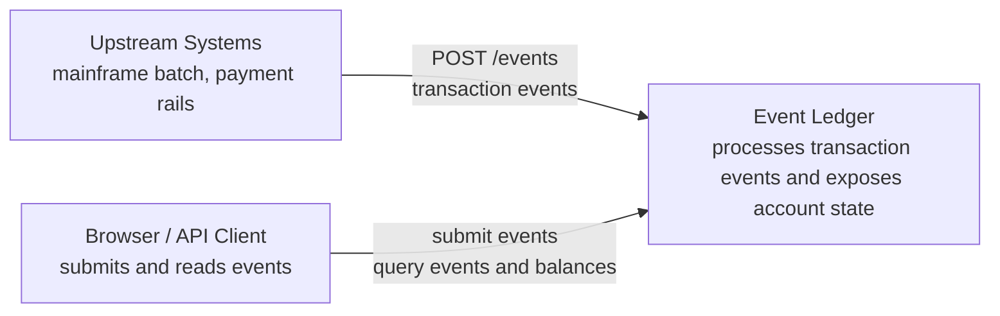
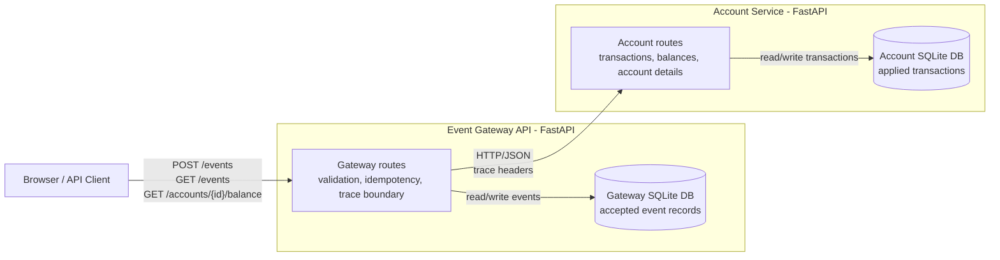
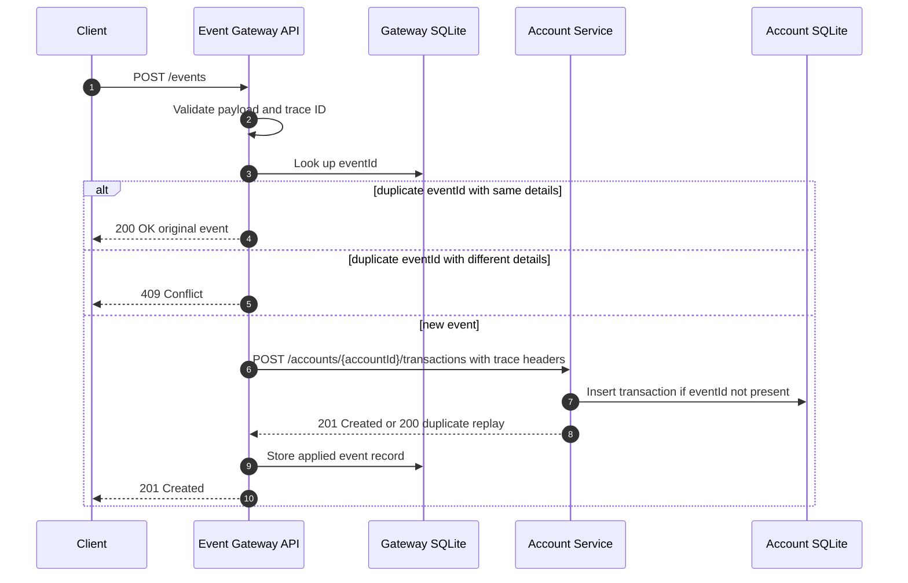

# Architecture

## Goals

Event Ledger is designed to demonstrate a production-oriented slice of a distributed financial event processor. The implementation favors simple, explicit mechanisms over infrastructure-heavy choices so the behavior can be reviewed and tested quickly.

Primary design goals:

- accept valid financial transaction events through a public Gateway
- prevent duplicate `eventId` submissions from double-applying money
- preserve chronological event history even when events arrive out of order
- keep Gateway and Account Service state physically separate
- expose enough logs, metrics, and health signals to operate the system
- degrade clearly when the Account Service is unavailable
- keep the Account Service internal to Gateway in the Docker Compose runtime

## C4 Diagrams

The C4 diagram source files are stored under [docs/diagrams](diagrams), with rendered SVG images checked in for easy review.

Rendered images:

- [System Context](diagrams/c4-context.svg)
- [Container Diagram](diagrams/c4-container.svg)
- [Gateway Component Diagram](diagrams/c4-component-gateway.svg)
- [Account Service Component Diagram](diagrams/c4-component-account-service.svg)

### C4 Level 1: System Context



### C4 Level 2: Containers



### C4 Level 3: Components

Rendered component diagrams:

- [Gateway Component Diagram](diagrams/c4-component-gateway.svg)
- [Account Service Component Diagram](diagrams/c4-component-account-service.svg)

## Request Flow



## Data Ownership

The Gateway owns event records used by public event reads:

- `event_id`
- `account_id`
- transaction details
- original `event_timestamp`
- metadata
- status and audit timestamps

The Account Service owns applied account transactions and balance calculation:

- `event_id`
- `account_id`
- transaction details
- original `event_timestamp`
- applied timestamp

This avoids shared mutable state. The same `eventId` is enforced as unique in both databases because idempotency must hold at both the public boundary and the internal money-moving boundary.

## Idempotency Strategy

The Gateway checks its local event table before calling the Account Service. If the `eventId` exists with identical event details, the Gateway returns the original event with `200 OK` and does not call the Account Service.

The Account Service also has a unique `event_id` constraint. This makes Gateway retries safe: if a timeout happens after the Account Service applied a transaction, the retry replays the same event and the Account Service returns its existing transaction without changing the balance again.

If the same `eventId` is submitted with different details, both services treat it as an idempotency-key conflict and return `409 Conflict`.

## Out-of-Order Events

Arrival order is not used for business ordering. Both services persist the original `eventTimestamp` and sort history by `eventTimestamp`, then `eventId` as a deterministic tie-breaker.

Balances are computed from the complete set of applied transactions:

```text
balance = sum(CREDIT amounts) - sum(DEBIT amounts)
```

This makes balance independent of event arrival order.

## Resiliency

The Gateway uses timeout plus retry with exponential backoff for calls to the Account Service.

This pattern is intentionally bounded:

- no infinite retries
- no long client hangs
- no hidden background queue
- clear `503 Service Unavailable` when the Account Service cannot be reached

The design is safe because both the Gateway and Account Service are idempotent by `eventId`.

## Graceful Degradation

When the Account Service is unreachable:

- `POST /events` returns `503 Service Unavailable`
- existing `GET /events/{id}` still works from the Gateway database
- existing `GET /events?account=...` still works from the Gateway database
- Gateway balance/account proxy endpoints return `503 Service Unavailable` with clear details

## Observability

Both services include:

- JSON structured logs
- `X-Trace-Id` and W3C `traceparent` propagation
- request metrics
- health checks with database connectivity diagnostics

The trace ID behavior is a lightweight substitute for full OpenTelemetry in this scoped exercise. W3C `traceparent` support keeps the propagation model compatible with an OpenTelemetry upgrade.
